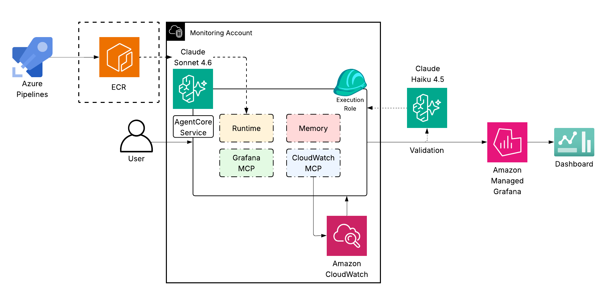

# CloudWatch Agent

An AI agent that explores AWS CloudWatch state and publishes curated Grafana dashboards in Amazon Managed Grafana, without any human writing JSON or learning the Grafana API.

The agent runs as an HTTPS endpoint behind Amazon Bedrock AgentCore Runtime. It reasons with Claude Sonnet 4.6, persists conversational state in Bedrock AgentCore Memory, validates every dashboard with a Claude Haiku 4.5 judge before publishing, and is graded post-hoc by a managed AgentCore Evaluator. Infrastructure deploys end-to-end with a single `terraform apply`.

## 1. Executive summary

| Aspect              | What it is                                                                                                            |
|---------------------|-----------------------------------------------------------------------------------------------------------------------|
| Goal                | Talk to AWS in natural language and get production-ready Grafana dashboards back.                                     |
| Primary surface     | An AgentCore Runtime endpoint invoked by `invoke.py`, a polished CLI REPL.                                            |
| Reasoning model     | `us.anthropic.claude-sonnet-4-6` (cross-region inference profile).                                                    |
| Judge model         | `us.anthropic.claude-haiku-4-5-20251001-v1:0`. ~5× faster than the main model.                                        |
| Conversation memory | Bedrock AgentCore Memory with three strategies: summarization, user preference, semantic facts.                       |
| Tools               | 4 custom + ~20 from AWS Labs CloudWatch MCP + ~10 from Grafana Labs MCP.                                              |
| Dashboard policy    | A "canonical 5" invariant: 1 overview + 4 service deep-dives ranked by a tiered composite (errors > warnings > info). |
| Quality gate        | Two-stage judge: LLM structural rubric + real Logs Insights query execution per panel.                                |
| Post-hoc evaluation | AgentCore Evaluator scoring every trace; results in the AgentCore console.                                            |
| Deployment          | One `terraform apply` from a clean account. Image is built and pushed by Terraform itself.                            |
| Demo data           | Three seed scripts in `seeds/` simulating three "weeks" of evolving service traffic.                                  |

## 2. Architecture



### 2.1 Container composition

| Layer                | Source                                                  | Role                                                                                                                               |
|----------------------|---------------------------------------------------------|------------------------------------------------------------------------------------------------------------------------------------|
| Base image           | `python:3.13-slim` (linux/arm64)                        | Runtime for the agent.                                                                                                             |
| `mcp-grafana` binary | Built from source in a Go `1.24-bookworm` build stage   | Provides `grafana_*` tools to Strands.                                                                                             |
| Python deps          | `uv sync --no-dev` against `pyproject.toml` + `uv.lock` | Strands, Bedrock SDK, AWS Labs CW MCP, rich, boto3, etc.                                                                           |
| App code             | `app/`                                                  | Entrypoint, tools, prompt, MCP wiring.                                                                                             |
| CMD                  | `uv run python -m app.main`                             | Plain entrypoint. **Not** `opentelemetry-instrument` — the OTLP exporter blocks when no collector is reachable inside the microVM. |

### 2.2 Service accounts and token lifecycle

The agent does **not** keep a static Grafana token. On every cold start `app/mcp_clients.py`:

1. Mints a short-lived `EDITOR` service-account token via the AMG control-plane API.
2. Passes the token as `GRAFANA_SERVICE_ACCOUNT_TOKEN` env var to the `mcp-grafana` subprocess.
3. Best-effort cleans up orphan tokens from prior containers (tier 1: expired-only; tier 2: quota recovery by deleting the oldest if ≥ 8 tokens are alive).
4. Registers an `atexit` cleanup that revokes the token on shutdown.

### 2.3 Memory model

AgentCore Memory is configured with three strategies in `terraform/memory.tf`:

| Strategy            | What it captures                                                                  |
|---------------------|-----------------------------------------------------------------------------------|
| **summarization**   | Rolling summaries of long sessions so the context window stays bounded.           |
| **user_preference** | Per-user preferences learned across sessions (e.g. preferred dashboard style).    |
| **semantic_facts**  | Stable facts the user told the agent (e.g. "we deprecated the payments service"). |

Continuity is per `runtimeSessionId`. `invoke.py`'s REPL reuses the same session id across turns automatically; one-shot mode generates a fresh id unless `--session-id` is passed.


## 3. The reasoning model

This is the part that makes the agent's output predictable from one run to the next.

### 3.1 Canonical-5 dashboard invariant

The agent maintains **exactly five canonical dashboards** in the workspace at any time:

| Slot | UID                     | Title                          | Source                                                         |
|------|-------------------------|--------------------------------|----------------------------------------------------------------|
| 1    | `cwagent-overview`      | `CloudWatch Agent — Overview`  | Cross-service summary. Permanent; never displaced.             |
| 2-5  | `cwagent-svc-<service>` | `CloudWatch Agent — <service>` | Per-service deep dive. One per top-4 service from the ranking. |

Incident dashboards (`cwagent-incident-<slug>`) sit **outside** the canonical 5 and are not auto-pruned.

When the data changes (a new high-error service appears, an old one goes quiet) the agent rebalances: re-ranks, swaps the lowest-priority service slot for the new winner, and calls `prune_dashboards_to_top_set` once at the end so the displaced dashboard is removed from Grafana.

### 3.2 Tiered service ranking

`rank_services_by_priority` runs one Logs Insights query and assigns each service a **tier** plus a within-tier composite score:

| Tier             | Definition                          | Within-tier score                                                                 |
|------------------|-------------------------------------|-----------------------------------------------------------------------------------|
| **1 — critical** | At least one `ERROR` in the window. | `0.5 · error_count + 0.3 · error_rate + 0.2 · p99_latency` (each normalized 0-1). |
| **2 — degraded** | No errors but at least one `WARN`.  | Same formula on warn metrics.                                                     |
| **3 — healthy**  | Only `INFO`.                        | Normalized traffic volume.                                                        |

The tool returns services sorted by `(tier asc, composite_score desc)`. The agent takes the first four as slots 2-5, regardless of whether they're all in tier 1 or spread across tiers. This way slots are always filled and the user can tell "real problem" slots from filler.

### 3.3 Mandatory build sequence

When the user asks for "build / regenerate / refresh the dashboard set", the agent follows this exact sequence:

| Step        | Action                                                                                                                                 | Tool(s)                                                                               |
|-------------|----------------------------------------------------------------------------------------------------------------------------------------|---------------------------------------------------------------------------------------|
| 1. Discover | Pick the target log group (from user input or ask). Sample 5 events to learn the field shape. Fetch the CloudWatch datasource UID.     | `cw_mcp_describe_log_groups`, `filter_log_events`, `get_cloudwatch_datasource`        |
| 2. Window   | Read the actual oldest/newest event timestamps and get a recommended `time.from` value sized to fit the data.                          | `get_data_window`                                                                     |
| 3. Rank     | Compute the tiered composite ranking for every service in the log group.                                                               | `rank_services_by_priority`                                                           |
| 4. Build    | Overview first, then services in priority order. For each: fetch existing version, assemble JSON, judge, iterate on `revise`, publish. | `grafana_get_dashboard_by_uid`, `judge_dashboard_quality`, `grafana_update_dashboard` |
| 5. Prune    | Delete any `cwagent-*` dashboard not in the new top set. Overview and incidents auto-preserved.                                        | `prune_dashboards_to_top_set`                                                         |

No hardcoded "primary" log group: the agent works with whichever log group the user names (or asks if ambiguous). The canonical-5 invariant assumes the log group has `service` + `level` fields; otherwise the agent falls back to an adapted structure (per-`@logStream` or per-error-pattern) and tells the user.

### 3.4 Overview dashboard content contract

The overview must be dense enough to answer "is everything OK right now, and which service is worst?" without clicking into any service dashboard. Minimum panel set (24-column grid):

| Row                      | y  | h | Panels                                                                               |
|--------------------------|----|---|--------------------------------------------------------------------------------------|
| 1 — headline stats       | 0  | 4 | total events · total ERRORs · overall error rate % · count of critical-tier services |
| 2 — cross-service trends | 4  | 8 | request volume by service (stacked, top-4) · ERROR count by service (stacked, top-4) |
| 3 — health signals       | 12 | 8 | p99 latency by service (top-4) · log level distribution (ERROR/WARN/INFO stacked)    |
| 4 — drill-in tables      | 20 | 8 | top 10 error messages · recent 50 ERROR events                                       |

Every panel uses `queryMode: "Logs"`, the chosen log group, `time.from` from `get_data_window`, and `bin(5m)` for time-series stats over a 60-minute data window.

### 3.5 Dashboard tag scheme

Three tags per dashboard, in this order:

| Position | Value                                                                                                        | Purpose                                                                                          |
|----------|--------------------------------------------------------------------------------------------------------------|--------------------------------------------------------------------------------------------------|
| 1        | `cloudwatch-agent` (always)                                                                                  | Identifies every agent-owned dashboard.                                                          |
| 2        | `overview` or the lowercase service name                                                                     | Scope.                                                                                           |
| 3        | One of `error-warning-info` / `error-warning` / `warning-info` / `error-info` / `error` / `warning` / `info` | Which log levels appear in the dashboard's data. Computed at build time from the ranking output. |

Grafana auto-assigns chip colors from the tag string hash; we don't try to control which color lands where.

## 4. Quality and observability

The agent has two complementary evaluation layers.

### 4.1 Synchronous judge (`judge_dashboard_quality`)

Runs **before every** `grafana_update_dashboard` call. Two stages:

**Stage 1 — Structural rubric.** A Bedrock Converse call to Claude Haiku 4.5 with a strict prompt. Checks schema, datasource references, `queryMode`, stable naming convention, layout, usefulness. Returns `{score, verdict, critique}`.

**Stage 2 — Data-plane validation.** Only runs if stage 1 approves. For every log-mode panel, the judge issues a real `StartQuery` / `GetQueryResults` against CloudWatch Logs Insights over the dashboard's declared time range. Queries run **in parallel** via `ThreadPoolExecutor` (10 concurrent), so a 10-panel overview validates in ~5 s instead of ~50 s sequential. Any panel returning 0 rows or whose query errors becomes a critique entry prefixed `DATA-PLANE CHECK FAILED`, and the verdict is downgraded to `revise`.

Verdict handling:

| Verdict   | Score                                 | Agent action                                                          |
|-----------|---------------------------------------|-----------------------------------------------------------------------|
| `approve` | ≥ 8 **and** every panel returned data | Publish via `grafana_update_dashboard`.                               |
| `revise`  | 5-7, **or** any data-plane failure    | Apply every critique item, re-judge. Cap: 3 iterations per dashboard. |
| `reject`  | < 5                                   | Rebuild from scratch using the critique as the spec. Re-judge.        |

Picking Haiku for the judge (instead of inheriting the main model) drops per-judge latency from ~3 s to ~0.6 s. With 5-15 judge calls per heavy turn that's 30-60 s shaved end-to-end.

### 4.2 AgentCore Evaluator (post-hoc, async)

A `level=TRACE` AgentCore Evaluator configured in LLM-as-a-Judge mode (Opus 4.6). It reads OTLP spans the runtime emits to the account-global `aws/spans` log group (created by CloudWatch Transaction Search) and scores each trace against a rubric similar to the synchronous judge — but after the fact. Scores appear in the AgentCore console under Evaluation.

Wired by an `awscc_bedrockagentcore_online_evaluation_config` in `terraform/evaluator.tf`. Sampling defaults to 100% (good for a demo; lower in production).

### 4.3 Runtime logs and metrics

| Where                                                  | What                                                                                                                                            |
|--------------------------------------------------------|-------------------------------------------------------------------------------------------------------------------------------------------------|
| `/aws/bedrock-agentcore/runtimes/<runtime-id>-DEFAULT` | Container stdout/stderr: Python prints, exceptions, MCP boot logs, `invocation_prompt session_id=... prompt=...` audit lines for every request. |
| `aws/spans` (account-global)                           | OTLP traces. Source for the AgentCore Evaluator.                                                                                                |
| `CloudWatch › AWS/BedrockAgentCore`                    | Invocations, errors, latency, throttles. Native dashboard under AgentCore console → Observability.                                              |

Each invocation logs the user's prompt at INFO level so prompt ↔ response pairs can be correlated in Logs Insights:

```
filter @message like /invocation_prompt/
| parse @message "session_id=* user_id=* prompt=*" as sid, uid, prompt
```

### 4.4 Tool-call budget

Strands' `Agent` has no built-in loop bound — it iterates until the model emits `end_turn` without a tool call. A `_ToolCallLimiter` hook in `app/main.py` caps it at **35 tool calls per invocation**, which covers the worst-case canonical-5 rebuild (discovery + ranking + 5 × judge × 3 retries + 5 × publish + prune ≈ 30) with headroom. On overflow the hook cancels further tool calls with a message telling the model to summarize and respond.

## 5. Deployment

### 5.1 AWS account prerequisites

| # | Item                                                                                                                                                                     | Why                                                                                                                                                                                                                       |
|---|--------------------------------------------------------------------------------------------------------------------------------------------------------------------------|---------------------------------------------------------------------------------------------------------------------------------------------------------------------------------------------------------------------------|
| 1 | Bedrock model access for `anthropic.claude-sonnet-4-6` and `anthropic.claude-haiku-4-5-20251001-v1:0`, enabled in **all three** of `us-east-1`, `us-east-2`, `us-west-2` | Both `us.*` inference profiles fan out across these regions; missing access in any one yields `AccessDeniedException` mid-call. Opus 4.6 is also IAM-allowlisted as a fallback if you want to switch back via env var.    |
| 2 | IAM Identity Center enabled in the account                                                                                                                               | Amazon Managed Grafana requires it for SSO login. If Identity Center's home region differs from the deploy region, set `identity_center_region` in `terraform.tfvars`.                                                    |
| 3 | CloudWatch Transaction Search enabled in the deploy region                                                                                                               | Creates the `aws/spans` log group the AgentCore Evaluator reads from. **Manual** step — AWS does not expose a Terraform-friendly API. Toggle from CloudWatch console → Application Signals → Transaction Search → Enable. |

### 5.2 Local tooling

| Tool               | Version        | Purpose                                                                                                                                  |
|--------------------|----------------|------------------------------------------------------------------------------------------------------------------------------------------|
| Terraform          | ≥ 1.9          | Infrastructure as code.                                                                                                                  |
| `uv`               | latest         | Python venv + dependency resolution.                                                                                                     |
| Docker with buildx | latest         | Container build.                                                                                                                         |
| QEMU binfmt        | one-time setup | Cross-arch build on amd64 hosts. Run `docker run --privileged --rm tonistiigi/binfmt --install arm64` once. Not needed on Apple Silicon. |
| AWS CLI v2         | latest         | Authenticated session for the target account.                                                                                            |

### 5.3 Deploy steps

**Step 1 — Configure Terraform variables.**

```bash
cp terraform/terraform.tfvars.example terraform/terraform.tfvars
$EDITOR terraform/terraform.tfvars
```

Variables you typically set:

| Variable                       | Purpose                                                                                                |
|--------------------------------|--------------------------------------------------------------------------------------------------------|
| `identity_center_region`       | Region where IAM Identity Center lives, if different from the deploy region.                           |
| `grafana_admin_user_names`     | Identity Center user names that get the `ADMIN` role in Grafana (include at least yourself).           |
| `grafana_grant_all_users_role` | Default role for everyone in the identity store (default `VIEWER`; set to `""` to disable auto-grant). |

If you want an S3 remote backend, also copy `terraform/backend.tf.example` to `terraform/backend.tf` and fill in the bucket name.

**Step 2 — `terraform apply`.**

```bash
cd terraform
terraform init
terraform apply
```

First apply takes 5-10 minutes. Most of that is building `mcp-grafana` from Go source and pushing the container image. Resources come up in dependency order: ECR → image build/push → IAM → Memory → Grafana workspace → Grafana service accounts → CloudWatch datasource → AgentCore Runtime → AgentCore Evaluator → OnlineEvaluationConfig.

Outputs include the runtime ARN, the Grafana workspace URL, the workspace ID, and the evaluator + online-eval config ARNs.

**Step 3 — Enable CloudWatch Transaction Search.**

AWS Console → CloudWatch → Application Signals → Transaction Search → Enable. AWS creates `aws/spans` automatically. If you skip this, the AgentCore Evaluator hangs in FAILED state. Re-apply Terraform after enabling and the evaluator creates cleanly.

**Step 4 — Verify.**

```bash
# Grafana login works
open "$(terraform -chdir=terraform output -raw grafana_workspace_url)"

# Agent endpoint exists
aws bedrock-agentcore-control list-agent-runtimes \
  --region us-west-2 \
  --query "agentRuntimes[?starts_with(agentRuntimeName,'cloudwatch_agent')]"
```

**Step 5 — Seed demo data.**

```bash
uv run python -m seeds.week1 --region us-west-2
```

See section 7 for the full three-week seed narrative.

## 6. Interacting with the agent

### 6.1 `invoke.py`

A single Python entrypoint with two modes. ARN is resolved in this order:

1. `AGENT_RUNTIME_ARN` env var.
2. `AGENT_RUNTIME_ARN` in `./.env`.
3. `terraform output -json` in `terraform/`.
4. `bedrock-agentcore-control:ListAgentRuntimes` filtered by `--runtime-name` (default `cloudwatch_agent`).

#### Interactive REPL

```bash
uv run python invoke.py
```

A banner panel shows the runtime ARN, session id, user, and command list. Then a `▸` prompt waits for input. The same session id is reused across turns, so AgentCore Memory carries context.

REPL commands:

| Command                      | Effect                                                   |
|------------------------------|----------------------------------------------------------|
| `:help`                      | Show command list.                                       |
| `:session`                   | Print the current session id.                            |
| `:new`                       | Rotate to a fresh session id (breaks memory continuity). |
| `:raw`                       | Toggle between rendered output and raw SSE event dump.   |
| `:exit` / `:quit` / `Ctrl-D` | Quit.                                                    |
| `Ctrl-C`                     | Cancel the in-flight stream; REPL stays alive.           |

#### One-shot

```bash
uv run python invoke.py "List the existing Grafana dashboards"

cat prompts/incident.md | uv run python invoke.py

# Chain one-shots with shared memory:
SID="cwagent-demo-$(date +%s)-aaaaaaaaaaaaaaaaaa"
uv run python invoke.py --session-id "$SID" "Explore the logs"
uv run python invoke.py --session-id "$SID" "Now build the dashboards"
```

#### `--export`

Writes a JSON session bundle to `./exports/` (configurable via `--export-dir`) when the REPL exits or on `:new`. Bundle contents per turn: prompt, cleaned assistant text blocks, tool call names, byte count, elapsed time, and the path to the raw SSE dump.

### 6.2 What you see on screen

| Element                                              | When                                                                                                                   |
|------------------------------------------------------|------------------------------------------------------------------------------------------------------------------------|
| `↪` marker                                           | Beginning of each assistant text block (one per agent iteration).                                                      |
| Rendered Markdown (bold, lists, tables, code blocks) | At each block close. The whole block prints at once via `rich.Markdown`.                                               |
| `⚡ tool_name`                                        | A tool call has just been dispatched.                                                                                  |
| `⏳ tool_name  3.2s` (spinner, live elapsed time)     | A tool is in flight. Daemon thread refreshes the counter twice a second.                                               |
| `✓ <summary>` (green)                                | Tool succeeded. Summary is tool-specific: `5 services ranked`, `approve (score 9)`, `published cwagent-svc-risk`, etc. |
| `✗ <error>` (red)                                    | Tool failed. First 200 chars of the error message.                                                                     |
| `· in tokens · out tokens · latency ms`              | End-of-turn stats.                                                                                                     |
| `── N bytes · Ts · raw → /tmp/agent-turn-N.json`     | Final summary line + path where the raw SSE stream was archived.                                                       |

### 6.3 Streaming model

- Text from the assistant is **buffered silently** while the spinner shows `✏️ writing`. At block close the whole block prints once as rendered Markdown.
- This avoids the cursor-walk-back-and-clear trick used previously, which could wipe earlier prompts when row counts drifted on emoji or wrapped lines.
- Side effect: prose doesn't appear character by character. The spinner's live elapsed counter and the per-iteration `↪` marker keep the experience feeling active.
- Terminal scrollback is preserved across prompts — you can scroll up through every previous turn in a REPL session.

### 6.4 Client read timeout

`invoke.py`'s `bedrock-agentcore` boto3 client is configured with `read_timeout=300` (5 min) and `retries={"max_attempts": 1}`. A streaming retry would re-invoke the agent from scratch — duplicating every tool call and the token bill — so retries are disabled by design.

## 7. Demo data (seeds)

Three seed scripts live in `seeds/`. Each writes structured JSON events into the same log group (`/cloudwatch-agent/demo`) and tells a small operational story.

### 7.1 Data model

| Field         | Type                       | Notes                                                                                 |
|---------------|----------------------------|---------------------------------------------------------------------------------------|
| `timestamp`   | ISO-8601 UTC               | When the event happened.                                                              |
| `level`       | `INFO` / `WARN` / `ERROR`  | Severity.                                                                             |
| `service`     | string                     | Which simulated service emitted the event.                                            |
| `message`     | string                     | Free-form, sampled from per-service templates.                                        |
| `status_code` | int                        | HTTP-style status (200, 401, 429, 500, 504, …).                                       |
| `latency_ms`  | int                        | Sampled from per-service `(low, high)` ranges.                                        |
| `request_id`  | hex                        | Unique per event.                                                                     |
| `error_code`  | string (only on incidents) | Distinctive code like `OrderDBConnectionPoolExhausted` so dashboards can pivot on it. |

### 7.2 The three weeks

| Seed    | Services touched                                         | Narrative                                                                                                                                                                                                                           |
|---------|----------------------------------------------------------|-------------------------------------------------------------------------------------------------------------------------------------------------------------------------------------------------------------------------------------|
| `week1` | `payments`, `orders`, `auth`, `gateway`                  | Baseline. `payments` has a recurring `retrying downstream dependency` WARN.                                                                                                                                                         |
| `week2` | + `checkout`, sharp `orders` incident                    | A new `checkout` service comes online. The week-1 `payments` WARN pattern disappears. A tight burst of `OrderDBConnectionPoolExhausted` lands in the last 10 minutes.                                                               |
| `week3` | + `risk`, + `identity`; `payments` and `auth` deprecated | Two new high-error services come online (`risk` ~65% error rate, `identity` ~45%). `payments` and `auth` collapse to ~1% of their week-2 volume with only deprecation WARNs left. Sharp `RiskModelInferencePoolExhausted` incident. |

Running each one demonstrates a different agent behavior: week1 = first build, week2 = rebalance + incident dashboard, week3 = aggressive rebalance with prune of deprecated services.

### 7.3 The "no backdating" rule

All seed events are spread uniformly across the last 60 minutes from the moment you run the script. This is deliberate.

CloudWatch Logs Insights only indexes events whose timestamp is later than the log group's `creationTime`. If the seed wrote timestamps from 13 days ago into a log group that was created 13 hours ago, those events sit happily in the log group (the Console "Log events" tab shows them, `filter_log_events` reads them) but Insights silently returns 0 rows for any query over them, which breaks the agent's aggregation path.

**Practical consequence:** never delete the log group between runs. To reset cleanly, delete the per-service **streams** instead:

```bash
for s in payments orders auth gateway checkout risk identity; do
  aws logs delete-log-stream --log-group-name /cloudwatch-agent/demo \
    --log-stream-name "$s" --region us-west-2 2>/dev/null
done
```

Then re-run the seed.

### 7.4 Running

```bash
uv run python -m seeds.week1 --region us-west-2
# ...prompt the agent to build the first dashboard set...
uv run python -m seeds.week2 --region us-west-2
# ...prompt: "regenerate the set; there's a recent orders incident, build a dashboard for it"...
uv run python -m seeds.week3 --region us-west-2
# ...prompt: "rebalance the set; the most critical services should occupy the per-service slots"...
```

Each script prints a per-service event count summary and a notes section with suggested prompts.

## 8. Suggested demo flow

A 15-minute demo that exercises every layer:

| Time  | Action                                                                                                | What to point out                                                                                                                                                       |
|-------|-------------------------------------------------------------------------------------------------------|-------------------------------------------------------------------------------------------------------------------------------------------------------------------------|
| 0:00  | `terraform apply` finished, Grafana workspace is empty                                                | One-command deploy.                                                                                                                                                     |
| 0:30  | `uv run python -m seeds.week1`                                                                        | Realistic JSON log events seeded into `/cloudwatch-agent/demo`.                                                                                                         |
| 1:00  | `uv run python invoke.py`, prompt: *"Build the canonical dashboard set for /cloudwatch-agent/demo"*   | Watch the spinner, tool calls (`⚡ get_data_window`, `⚡ rank_services_by_priority`, `⚡ judge_dashboard_quality`, `⚡ grafana_update_dashboard`), and the final URL list.  |
| 5:00  | Open Grafana, walk through the 5 dashboards                                                           | Overview density, tier-driven service slots, panels populated with data on first open thanks to `get_data_window`.                                                      |
| 8:00  | `uv run python -m seeds.week2` (introduces incident)                                                  | Data has changed.                                                                                                                                                       |
| 8:30  | Prompt: *"Regenerate the dashboard set and build an incident dashboard for the recent orders outage"* | Agent rebalances; `grafana-incident-<slug>` dashboard appears.                                                                                                          |
| 11:00 | `uv run python -m seeds.week3` (introduces risk + identity, deprecates payments + auth)               | Data changes again.                                                                                                                                                     |
| 11:30 | Prompt: *"Rebalance"*                                                                                 | Watch the prune step delete the displaced `cwagent-svc-payments` and `cwagent-svc-auth` dashboards. New `cwagent-svc-risk` and `cwagent-svc-identity` take their place. |
| 13:00 | AgentCore Console → Evaluation                                                                        | Post-hoc evaluator scores for the recent traces.                                                                                                                        |
| 14:00 | Show `/aws/bedrock-agentcore/runtimes/<id>-DEFAULT` log group                                         | `invocation_prompt` audit lines and full per-tool execution trace.                                                                                                      |

## 9. Operational guide

### 9.1 Switching models

The defaults are encoded in three places that must stay in sync:

| File                   | Variable                                                      | Default                                                                              |
|------------------------|---------------------------------------------------------------|--------------------------------------------------------------------------------------|
| `app/config.py`        | `MODEL_ID` (env-overridable)                                  | `us.anthropic.claude-sonnet-4-6`                                                     |
| `app/tools/judge.py`   | `JUDGE_MODEL_ID` (env-overridable)                            | `us.anthropic.claude-haiku-4-5-20251001-v1:0`                                        |
| `terraform/runtime.tf` | `MODEL_ID`, `JUDGE_MODEL_ID` env vars on the runtime resource | same as above                                                                        |
| `terraform/iam.tf`     | `InvokeBedrockModels` statement                               | Whitelists Sonnet 4.6, Haiku 4.5, Opus 4.6 inference-profile + foundation-model ARNs |

To swap (e.g. back to Opus 4.6 for the main agent), change the value in `terraform/runtime.tf`, set the IAM if a new model needs allowlisting, and `terraform apply`.

### 9.2 Granting Grafana access

| Mechanism              | Variable                       | Effect                                                                                                                                                             |
|------------------------|--------------------------------|--------------------------------------------------------------------------------------------------------------------------------------------------------------------|
| Per-user ADMIN         | `grafana_admin_user_names`     | Each listed Identity Store username gets the `ADMIN` role.                                                                                                         |
| Bulk role for everyone | `grafana_grant_all_users_role` | Default `VIEWER`. Set to `EDITOR` to give everyone edit rights, or `""` to disable. Excludes the admin users so they don't collide on lower-priority associations. |

Both take effect on the next `terraform apply`.

### 9.3 Pausing the AgentCore Evaluator

Change `execution_status` in `terraform/evaluator.tf` from `"ENABLED"` to `"DISABLED"` and apply. The evaluator stops scoring new traces without being destroyed. Flip back to re-enable.

### 9.4 Switching deploy region

Most resources are parameterized by `var.region` (set in `terraform.tfvars`). Exceptions to be aware of:

- The Bedrock inference profile fan-out regions are properties of the profile itself — they don't follow `var.region`.
- The `aws/spans` log group lives in the deploy region (it's account-global, but the data plane is regional).
- If Identity Center's home region differs from the new deploy region, set `identity_center_region` explicitly.

## 10. Troubleshooting

### 10.1 Agent says it can't find events in the log group

Three usual causes:

1. **Seed never ran in the deploy region.** Verify with `aws logs describe-log-groups --region <region>` that `storedBytes > 0`.
2. **Timestamps fell before the log group's `creationTime`.** Happens if the log group was deleted and recreated. The Console shows events but Insights returns 0. Reset by deleting the streams, not the log group (see §7.3).
3. **Transaction Search not enabled.** Insights queries against fresh log groups have 5-15 min indexing lag. `filter_log_events` (which goes through `FilterLogEvents`, no indexing) sees data immediately; the agent falls back to it automatically when configured correctly.

### 10.2 Grafana login returns `sso.auth.access-denied`

Your Identity Center user has no role association on the workspace. Check that you're in `grafana_admin_user_names` or that `grafana_grant_all_users_role` is non-empty. If Identity Center lives in a different region from the deploy, also confirm `identity_center_region`. Re-apply and refresh the Grafana page.

### 10.3 Bedrock returns `aws-marketplace:Subscribe` or `AccessDeniedException` mid-call

The selected model is not enabled in one of the inference-profile fan-out regions. Open the Bedrock console in **each** of `us-east-1`, `us-east-2`, `us-west-2` separately and enable model access for both Sonnet 4.6 and Haiku 4.5.

### 10.4 `Service Account Token quota has been reached`

AMG caps active tokens per service account at ~10. If the container restarts frequently without a clean shutdown, tokens accumulate. The container's startup cleanup deletes expired tokens and force-deletes the oldest when ≥ 8 of "ours" are alive — but if the IAM role lacks `grafana:ListWorkspaceServiceAccountTokens`, the cleanup can't run.

Manual recovery:

```bash
WS_ID=$(aws grafana list-workspaces --region us-west-2 \
  --query "workspaces[?name=='cloudwatch_agent'].id | [0]" --output text)
SA_ID=$(aws grafana list-workspace-service-accounts \
  --workspace-id "$WS_ID" --region us-west-2 \
  --query "serviceAccounts[?name=='cloudwatch-agent'].id | [0]" --output text)
for TID in $(aws grafana list-workspace-service-account-tokens \
    --workspace-id "$WS_ID" --service-account-id "$SA_ID" --region us-west-2 \
    --query 'serviceAccountTokens[].id' --output text); do
  aws grafana delete-workspace-service-account-token \
    --workspace-id "$WS_ID" --service-account-id "$SA_ID" \
    --token-id "$TID" --region us-west-2
done
```

Then `terraform apply` so the next container start re-mints cleanly.

### 10.5 The AgentCore Evaluator stays in `DISABLED`

Two causes:

1. `execution_status` was left at the API default (`DISABLED`) at create time. Set it to `"ENABLED"` in `terraform/evaluator.tf` and apply.
2. The `aws/spans` log group doesn't exist (Transaction Search never enabled). The resource's underlying state is FAILED but surfaces as DISABLED. Enable Transaction Search and re-apply.

### 10.6 `ReadTimeoutError` from `invoke.py`

The client's `read_timeout` is 300 s. If a single turn exceeds that — usually because the model is in a tool-call loop — the underlying request is still alive on the server. Check the runtime log group for the in-flight invocation. The `_ToolCallLimiter` (35-call cap) should prevent infinite loops but doesn't shrink each individual model round.

### 10.7 "Network error" in the AgentCore web console

The browser-side SSE viewer is fragile on large responses. The server-side filter in `app/main.py` drops non-JSON-serializable events to keep payloads sane, but multi-MB streams can still trip the browser. Use `invoke.py` instead — boto3 handles streams of any size cleanly.

## 11. Cost notes

| Component                         | Driver                                   | Estimate for the demo                                                                                  |
|-----------------------------------|------------------------------------------|--------------------------------------------------------------------------------------------------------|
| Bedrock — Sonnet 4.6 (main agent) | Input + output tokens                    | A full canonical-5 rebuild ≈ 80-120k tokens total across all model rounds.                             |
| Bedrock — Haiku 4.5 (judge)       | Input + output tokens                    | 5-15 judge calls per rebuild × ~3k tokens each. Cheaper than Sonnet by ~5×.                            |
| AgentCore Runtime                 | vCPU-seconds + GB-seconds on the microVM | Negligible at demo traffic.                                                                            |
| AgentCore Memory                  | Events stored + strategy processing      | Cheap unless you accumulate thousands of sessions.                                                     |
| AgentCore Evaluator               | Per-trace evaluation tokens              | Defaults to 100% sampling — lower in production via `sampling_percentage` in `terraform/evaluator.tf`. |
| Amazon Managed Grafana            | Per active user per month                | The agent's service account is **not** billable. Identity Center users with role associations are.     |
| CloudWatch Logs                   | GB ingested + stored                     | `aws/spans` grows with invocation count. Set retention if it matters.                                  |
| ECR                               | GB-month storage                         | Negligible — `terraform/ecr.tf` has a lifecycle policy that prunes old image tags.                     |

To minimize cost in a long-running demo:

- Lower `sampling_percentage` in `terraform/evaluator.tf` from 100 to 10-20.
- Set `grafana_grant_all_users_role = ""` if not everyone needs Grafana access.
- Switch `JUDGE_MODEL_ID` to Haiku (already the default — confirm it's not overridden).

## 12. Cleanup

```bash
cd terraform
terraform destroy
```

This removes: AgentCore Runtime, Memory, Evaluator, OnlineEvaluationConfig, Grafana workspace (and all dashboards + service accounts + tokens), ECR repository (and all images), IAM roles, and the runtime's own log group.

**Terraform does not own** these and they stay around:

- `/cloudwatch-agent/demo` (created by the seed scripts directly via `PutLogEvents`).
- `aws/spans` (created by Transaction Search when you enabled it).

Delete manually if needed:

```bash
aws logs delete-log-group --log-group-name /cloudwatch-agent/demo --region us-west-2
aws logs delete-log-group --log-group-name aws/spans --region us-west-2
```

### Stale-token edge case

If `terraform destroy` runs more than 30 days after the last `apply`, the provisioner token used by the Grafana provider to administer the workspace datasource has expired (AMG max TTL is 30 days) and the destroy hangs trying to delete the datasource. Workaround:

```bash
terraform -chdir=terraform apply \
  -replace=aws_grafana_workspace_service_account_token.terraform
terraform -chdir=terraform destroy
```
